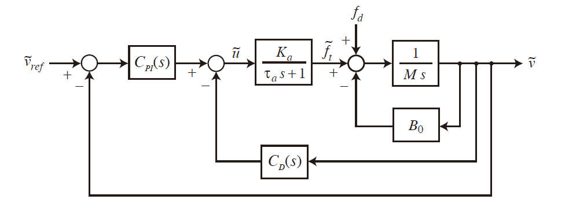
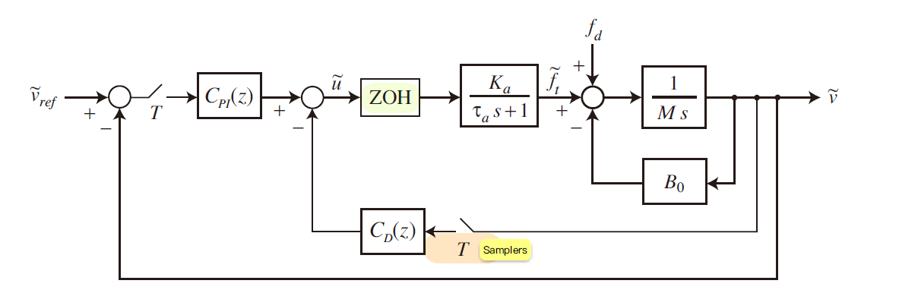
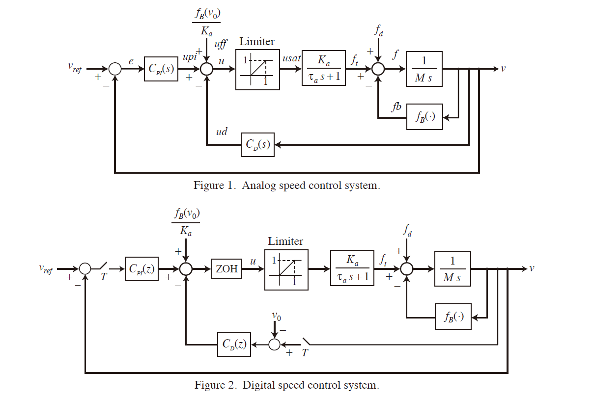
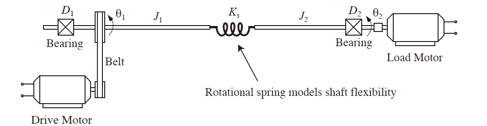
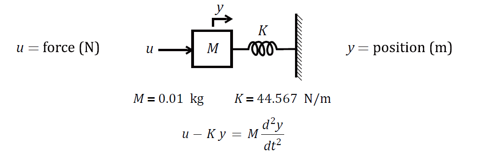
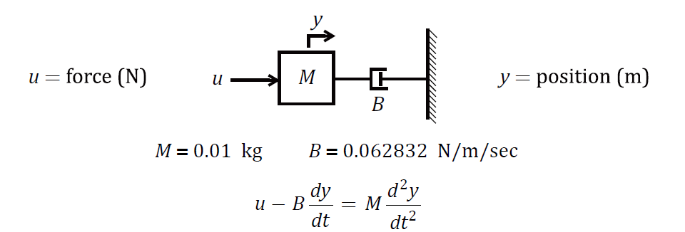
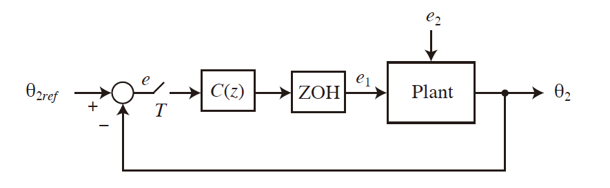
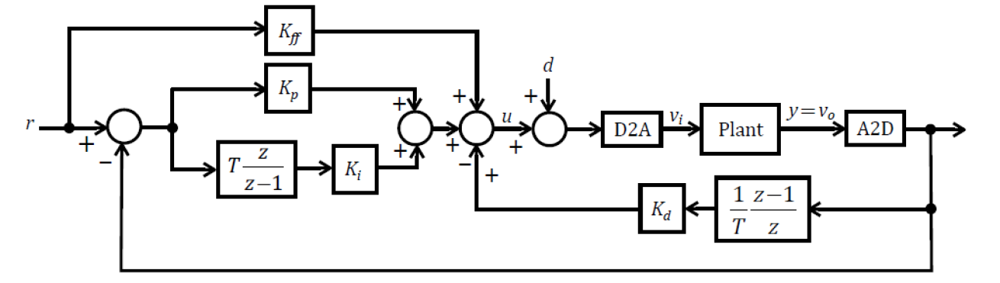

# 
Summary of ME581

## 
**📥[HW3](https://github.com/KCLTLH/ControllDesign_ME581/tree/main/W3)**

### 
Focuses on car speed control dynamics using Matlab or Python-Control. Emphasizes proportional-integral and derivative control laws. 

 

## 
**📥[HW4](https://github.com/KCLTLH/ControllDesign_ME581/tree/main/W4)**

### 
Transitions from continuous to discrete-time systems in speed control. Highlights discretization implications on system performance. 

 

## 
**📥[HW5](https://github.com/KCLTLH/ControllDesign_ME581/tree/main/W5)**

### 
Compares analog and digital control in a nonlinear car speed model. Examines responses under various conditions. 

 

## 
**📥[HW6](https://github.com/KCLTLH/ControllDesign_ME581/tree/main/W6)**

### 
 Involves DC motor control system design and analysis. Emphasizes dynamic modeling and controller design. 

 

## 
**📥[HW7](https://github.com/KCLTLH/ControllDesign_ME581/tree/main/W7)**

### 
 Explore z-plane root locus methods for compensator design in discrete-time systems. Focuses on mass-spring and mass-damper systems. 

<figure>
    
    
<figcaption>Spring System</figcaption>

</figure>

<figure>
    
    
<figcaption>Damping System</figcaption>

</figure>
 

## 
**📥[HW8](https://github.com/KCLTLH/ControllDesign_ME581/tree/main/W8)**

### 
 Covers digital control system design for DC motors, emphasizing loop shaping and compensator design. 

 

## 
**🥼[LAB](https://github.com/KCLTLH/ControllDesign_ME581/tree/main/LAB)**

### 
 On board implement PID with certain objectives.

### 
 Here are results. 

|                                          |                                            |
|------------------------------------------|--------------------------------------------|
|  |  |
|   |        |

