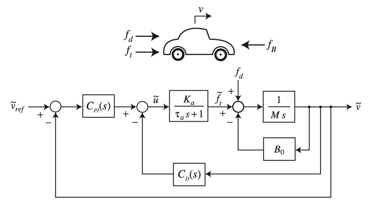
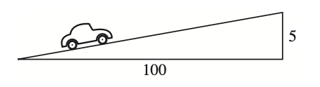
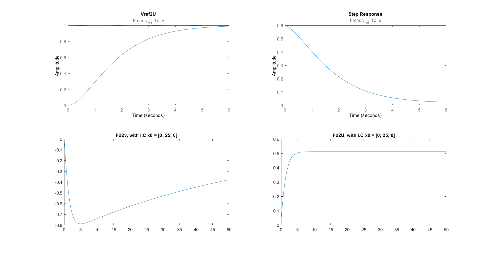

<h1 align="center" style="color: white; background-color: black; padding: 10px;">🏎 HW3 Summary</h1>

    

    

### 
 In this homework, we simulate the car system on the flat road and on a slope. Knowing the basic implementation of PID controller and knowing what the meaning behind the plot. 

## 
 🖊Plot from system 

    

### 
 Interpretation 

#### &nbsp;&nbsp;&nbsp;&nbsp;The plot on the first row. Left plot shows how V changes with a Vref unit-step input. Due to we got PID in our system, it eventually will reach magnitude = 1. Right one shows the system generate a initial U from 0.6 to eventually nearly to 0. To give the car the ability to reach 1 m/s as soon as possible. Why is 0.6 at first is because, the system initial error feedback signal is 0.6.

#### &nbsp;&nbsp;&nbsp;&nbsp;The plot on second row. Due to car initial start from a slope. Hence, the magnitude at the beginning start from negative. The right plot, due to car need to deal with car's "Component of Gravity". Therefore, it will be constant at the end.
