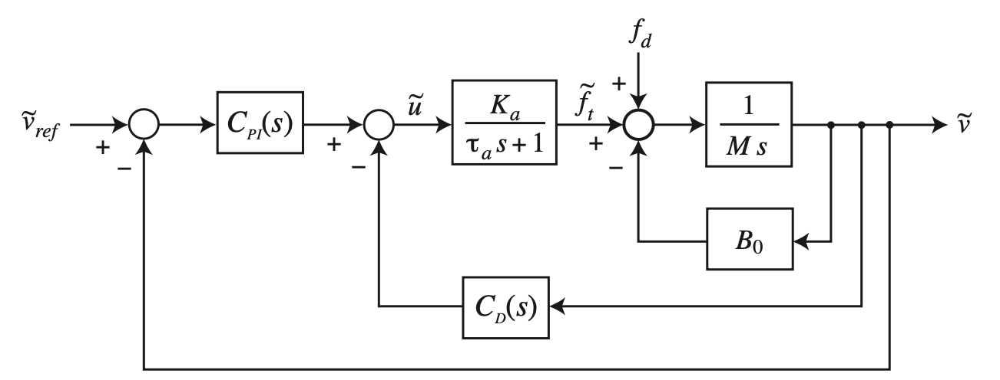
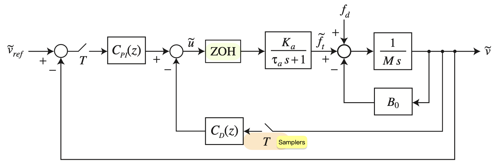
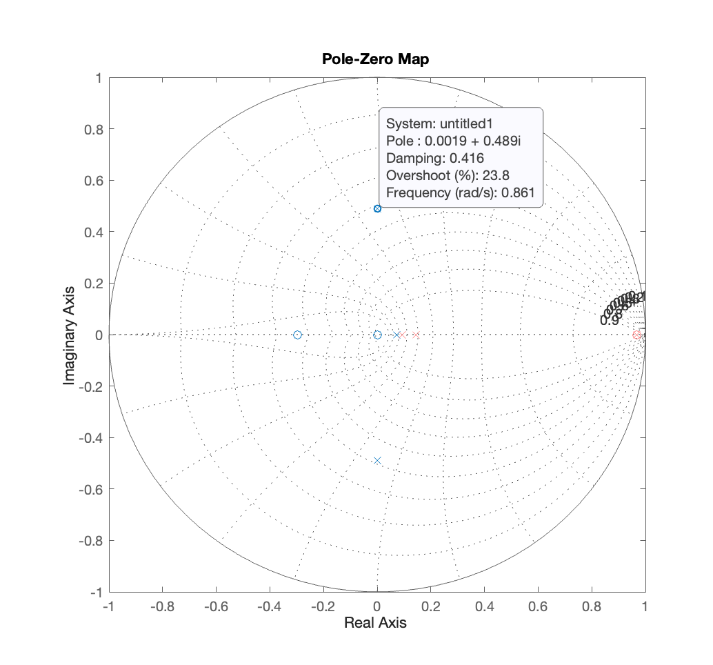
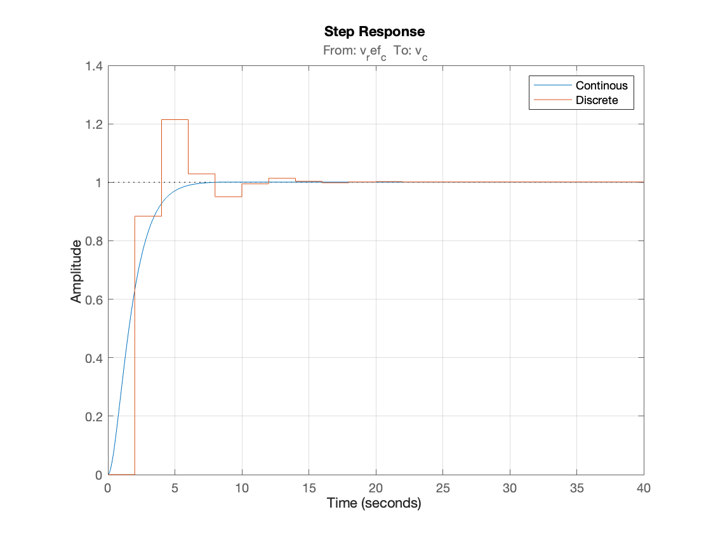

<h1 align="center" style="color: white; background-color:; padding: 10px;">HW4 Summary</h1>

    

    

### 
 In this homework we will learn how to simulate discrete & continuous time, and how to interpretation PZ map information. 

<h2 align="center" style="color: white; background-color:; padding: 10px;">🖊Plot from system</h2>

    

    

<h2 align="center" style="color: white; background-color:; padding: 10px;">👀Interpretation</h2>

### From the PZ map, we can know the discrete time dominate pole overshoot is 28%. In the second picture, we do see the overshoot is 20% ish.
### Why the right plane of the poles is not dominate pole? Pole zero cancellation.
### Why the discrete time simulation outcome seems so poor? The time constant (τ = 2.79s) and T = 2 sec. T is too close to τ, causing Aliasing.

<h1 align="center" style="color: white; background-color:pink; padding: 10px;">🧮 Calculation</h1>

 

<h2 align="center" style="color: white; background-color:; padding: 10px;">Approximate Bandwidth (fB)</h2>

#### The bandwidth of a first-order system can be approximated as the inverse of the time constant.
### fB = 1/(2 π τ)

#### For τ = 2.79 seconds, the approximate bandwidth fB = `0.057 Hz`

<h2 align="center" style="color: white; background-color:; padding: 10px;">Minimum Nyquist Frequency (fN)</h2>

#### The Nyquist frequency should be at least twice the bandwidth to satisfy the Nyquist criterion for sampling.

### fN ≥ 2fB ≥ `0.11409 Hz`

#### Thus, the minimum Nyquist frequency fN is:

### fN ≈ `0.114 Hz`

<h2 align="center" style="color: white; background-color:; padding: 10px;">Conclusion</h2>

### Approximate Bandwidth **fB** : `0.057 Hz`
### Minimum Nyquist Frequency **fN** : `0.114 Hz`
### Minimum Sampling Frequency **fs** : `0.228 Hz`

