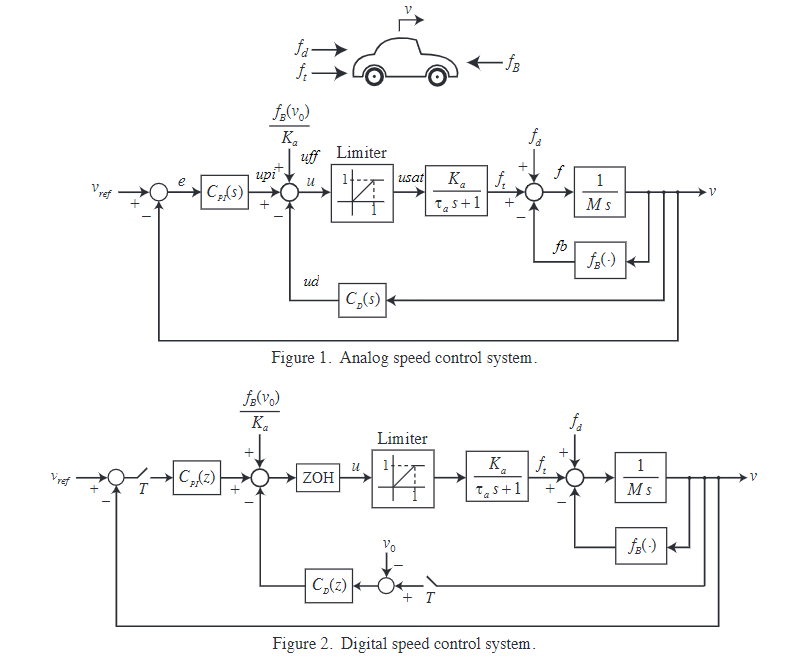
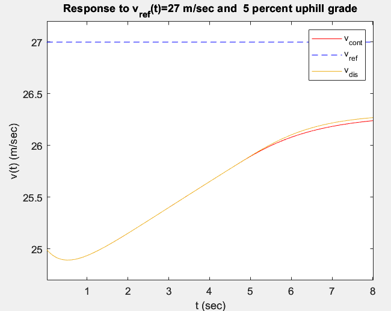
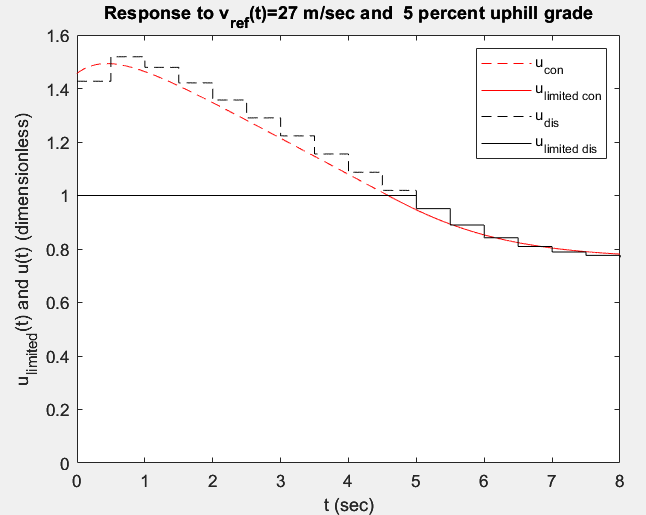
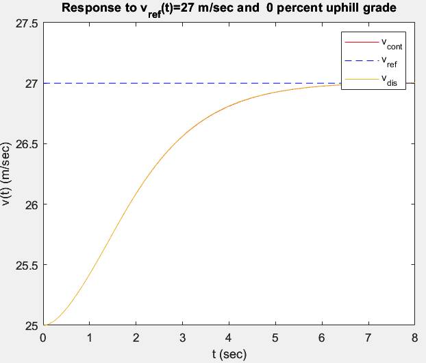
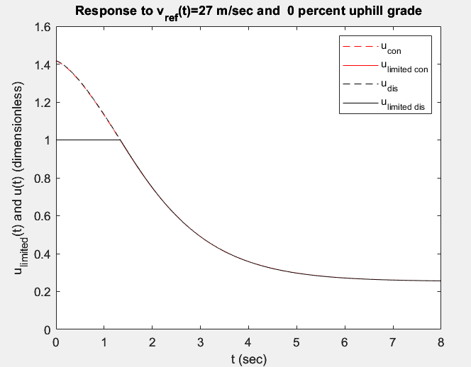

<h1 align="center" style="color: white; background-color:; padding: 10px;">HW5 Summary</h1>

    

### 
 In this practice we will compare Analog speed control to a Digital speed control system with operation velocity V0 = 25 m/s and Tsampling = 0.5 sec. Also, practice using Simulink in this problem set. 

 

    

    

### As the plot shown above, "Digital" seems to fit "Analog" pretty well, how there is still little difference between.

## How can we solve it? 💬
### Shrink the sampling time. (e.g Tsampling from 0.5 sec to 0.01 sec)

    

    

## How can we solve it? 💭
### Re-design the PID controller. (We will talk about it in further homework.)
