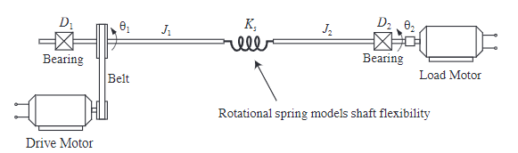
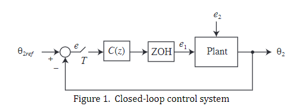
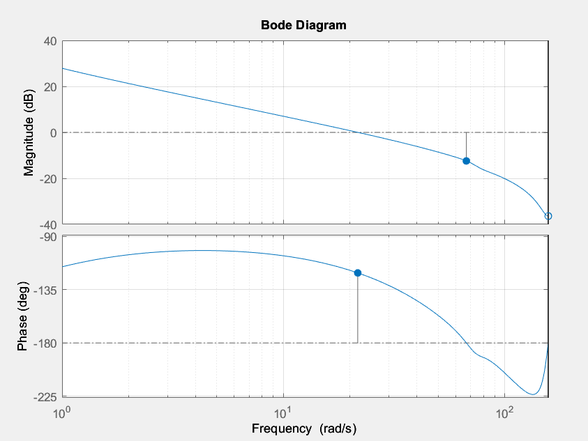
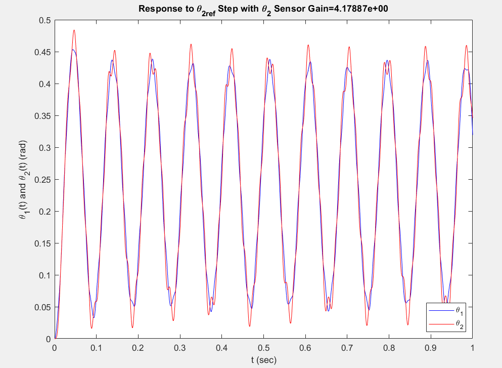
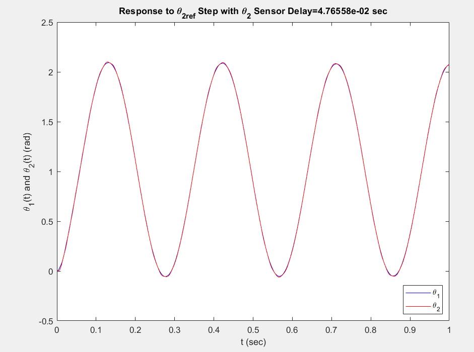

<h1 align="center" style="color: white; background-color:; padding: 10px;">HW6 Summary</h1>

    

    

 

### In this problem set, we will simulate a Motor system. Moreover, determining the time delay will make a system unstable and gain. By the Bode plot.

    

 

### Why is the smallest positive gain for the sensor being important? 💡
#### This task is important because it helps to understand the limits of system performance and stability under varying conditions. Specifically, it deals with how changes in the gain of a sensor, which measures a critical parameter (in this case, θ2 ), can affect the overall stability of the control system.

    

 

### Why is delay time important? 💡
#### This time delay could represent the computation time for a digital computer to update the control signal after each sampling instant. Setting a delay in this context is important to understand how time delays in the feedback loop can affect the stability of the system. Delays in feedback are common in real-world applications, and understanding their impact is crucial for designing stable control systems.

    

